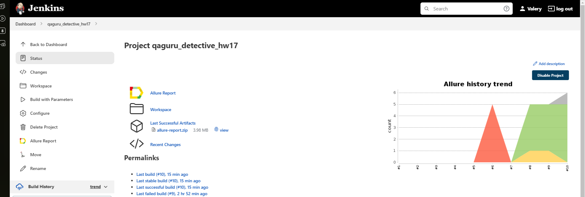
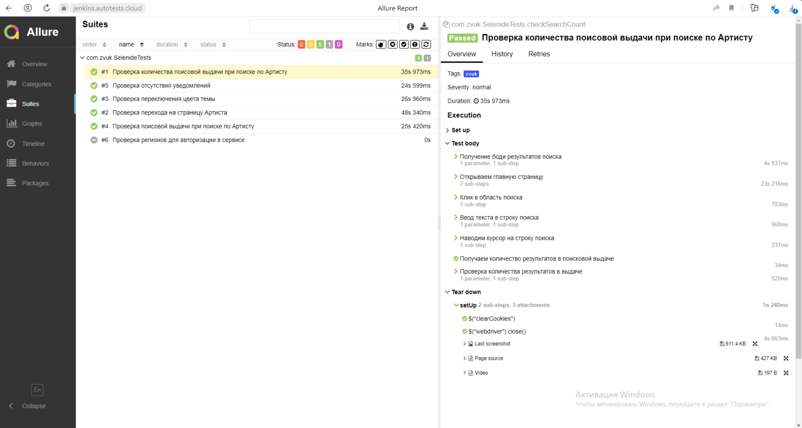
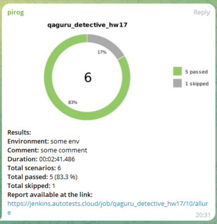
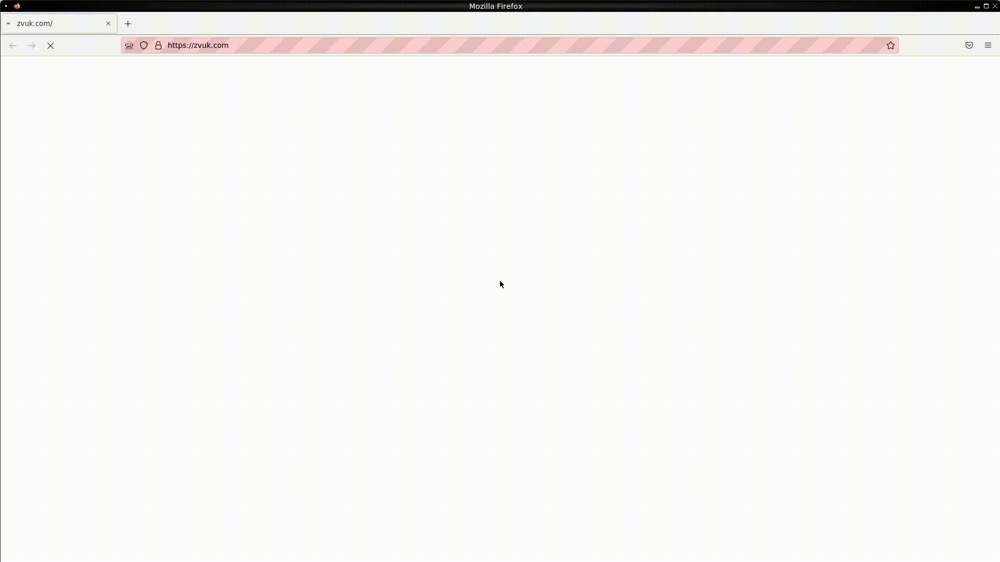

<h2 align="center"> Проект по автоматизации тестирования компании ЗВУК </h2> 

## :classical_building: Технологический стек

## :airplane: Автоматизированные тест кейсы
- :white_check_mark: Проверка поисовой выдачи при поиске по Артисту
- :white_check_mark: Проверка перехода на страницу Артиста
- :white_check_mark: Проверка количества поисовой выдачи при поиске по Артисту
- :white_check_mark: Проверка отсутствия уведомлений
- :white_check_mark: Проверка переключения цвета темы
- :white_check_mark: Проверка стран для авторизации в сервисе

## </a> Jenkins job

<a target="_blank" href="https://jenkins.autotests.cloud/job/qaguru_detective_hw17">Сборка в Jenkins</a>

## </a>*Отчет в Allure Report*

### Основное окно

### Тесты

##  </a>Уведомления в Telegram с использованием бота

## </a> Видео с прохождением тестов

