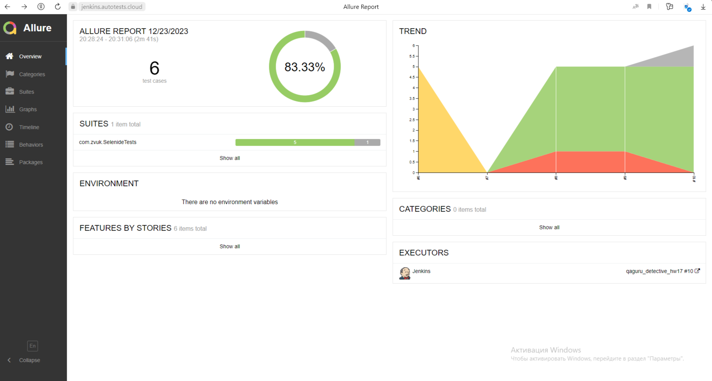
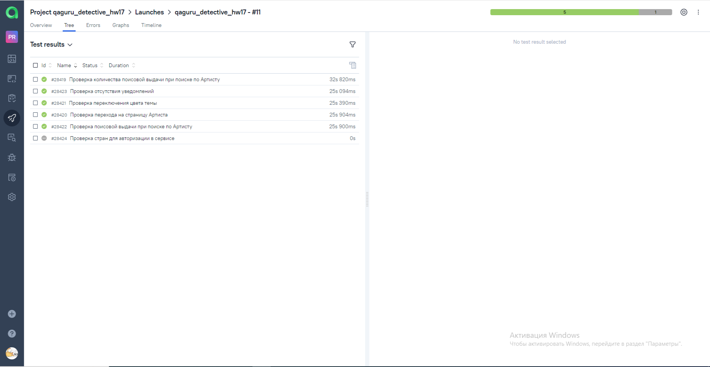
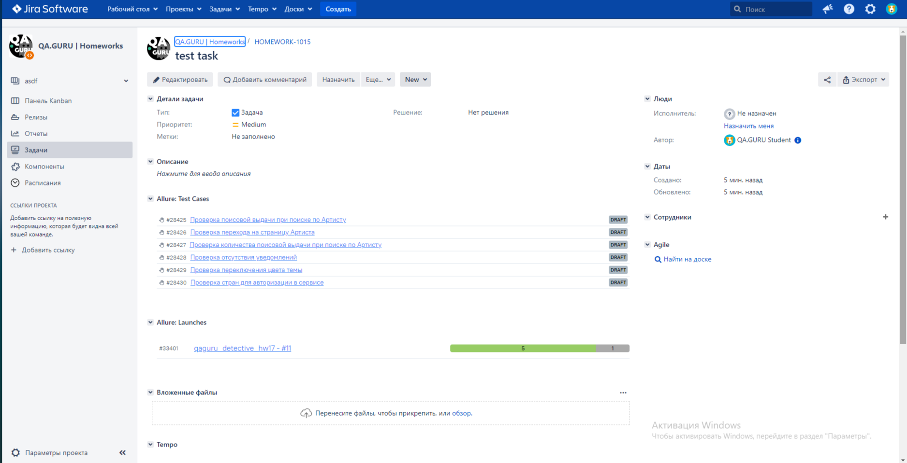

<h2 align="center"> Проект по автоматизации тестирования компании ЗВУК </h2> 

## :classical_building: Технологический стек

## :airplane: Автоматизированные тест кейсы
- :white_check_mark: Проверка поисовой выдачи при поиске по Артисту
- :white_check_mark: Проверка перехода на страницу Артиста
- :white_check_mark: Проверка количества поисковой выдачи при поиске по Артисту
- :white_check_mark: Проверка отсутствия уведомлений
- :white_check_mark: Проверка переключения цвета темы
- :white_check_mark: Проверка стран для авторизации в сервисе

## </a> Сборка в <a target="_blank" href="https://jenkins.autotests.cloud/job/qaguru_detective_hw17"> Jenkins </a>

## </a>Отчет в <a target="_blank" href="https://jenkins.autotests.cloud/job/qaguru_detective_hw17/allure/"> Allure Report </a>

### Основное окно

### Тесты

##  </a>Уведомления в Telegram с использованием бота

##  </a>Интеграция тестов c тест-менеджмент системой  <a target="_blank" href="https://allure.autotests.cloud/project/3899/dashboards"> Allure TestOps </a>

##  </a>Интеграция тестов c таск-трекер системой <a target="_blank" href="https://jira.autotests.cloud/browse/HOMEWORK-1015"> Jira </a>

## </a> Видео с прохождением тестов

